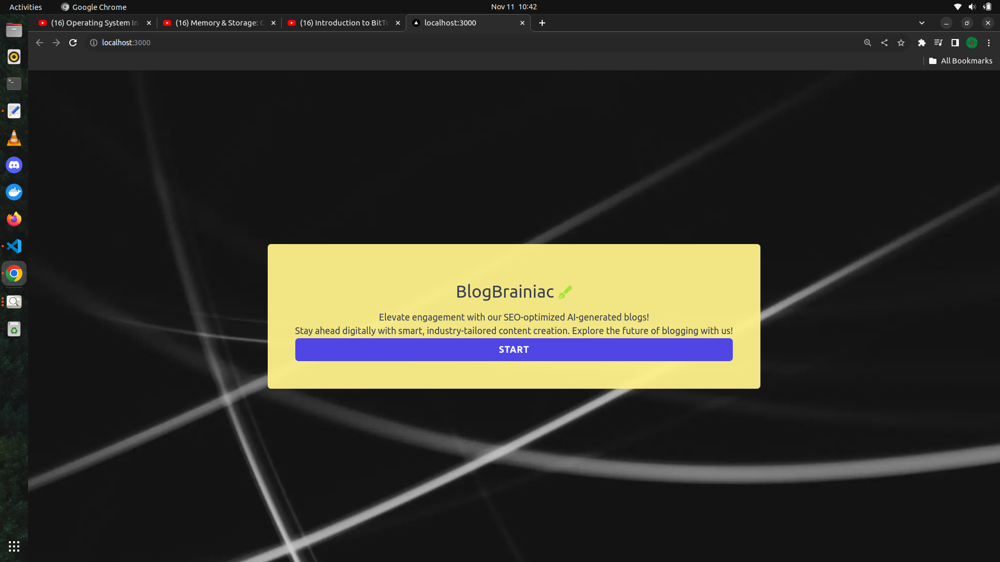
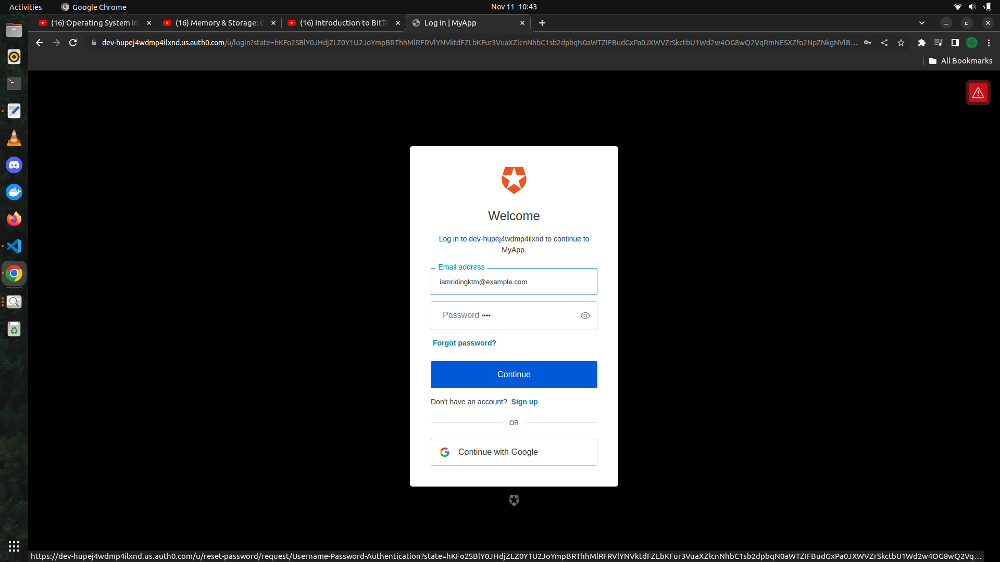

# BlogBrainiac - An AI generated SEO friendly website for creating blogs

## Key Feature

- A Next.js app that uses OpenAI GPT Turbo API key to generate SEO-friendly blogs 
- User authentication is implemented through Auth0
- Stripe is used for handling payments with the implementation of stripe webhooks
- MongoDB database is used for storing the token user data and post data.

## Homepage

## Authwall

## Add Tokens Page

## Stripe Payment Gateway

## Blog Generation Page

## Blog Generated Page

